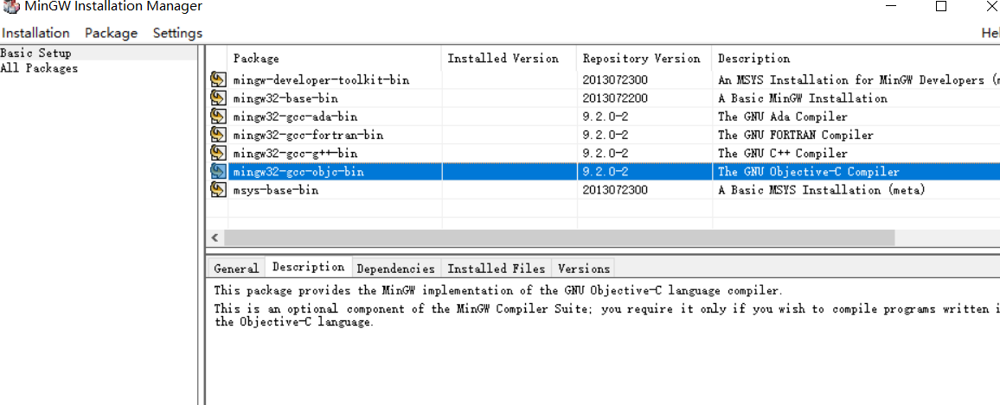

## windows配置c++和make

1. 下载minge

   https://osdn.net/projects/mingw/downloads/68260/mingw-get-setup.exe/

2. 安装到D:\MinGW

3. 选择组件，安装

   like image1 image2

4. 添加环境变量

   在系统环境变量path中，添加D:\MinGW\bin

5. gcc -v

6. make改名

   D:\MinGW\bin目录下的mingw32-make.exe重命名为make.exe

7. make -v





## VS Code

bug，为什么bustub必须cmake完才不会有红色波浪线报错

```
虚拟机（make过）
{
    "configurations": [
        {
            "name": "Linux",
            "includePath": [
                "${workspaceFolder}/src/**"
            ],
            "defines": [],
            "compilerPath": "/usr/bin/clang-12",
            "cStandard": "c17",
            "cppStandard": "c++14",
            "intelliSenseMode": "linux-clang-x64",
            "compileCommands": "${workspaceFolder}/build/compile_commands.json"
        }
    ],
    "version": 4
}

{
    "configurations": [
        {
            "name": "Linux",
            "includePath": [
                "${workspaceFolder}/**"
            ],
            "defines": [],
            "compilerPath": "/usr/bin/clang-12",
            "cStandard": "c17",
            "cppStandard": "c++14",
            "intelliSenseMode": "linux-clang-x64"
        }
    ],
    "version": 4
}

wsl(没有make过)
{
    "configurations": [
        {
            "name": "Linux",
            "includePath": [
                "${workspaceFolder}/**"
            ],
            "defines": [],
            "compilerPath": "/usr/bin/gcc",
            "cStandard": "gnu17",
            "cppStandard": "gnu++14",
            "intelliSenseMode": "linux-gcc-x64"
        }
    ],
    "version": 4
}
```

vscode两种C++插件有啥区别？

## Clion

从0创建一个项目试试？https://blog.csdn.net/qq_44723773/article/details/104698675

代码存放在WSL环境

Clion直接打开文件夹

进入后弹出配置界面，直接管理工具链，里面建立WSL工具链（可以修改编译目录为build）

根据cmake信息，在WSL中安装补齐相关工具