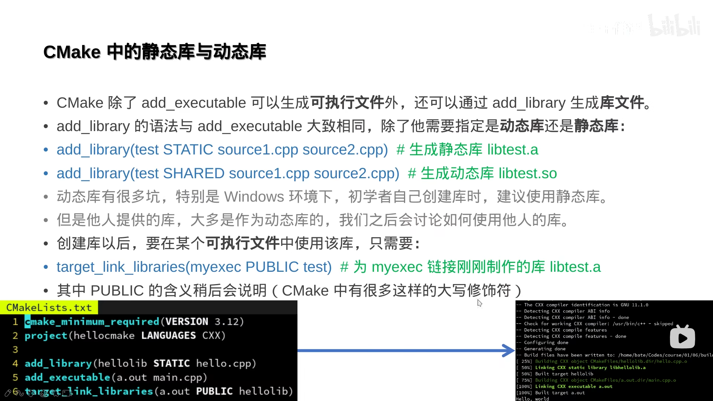
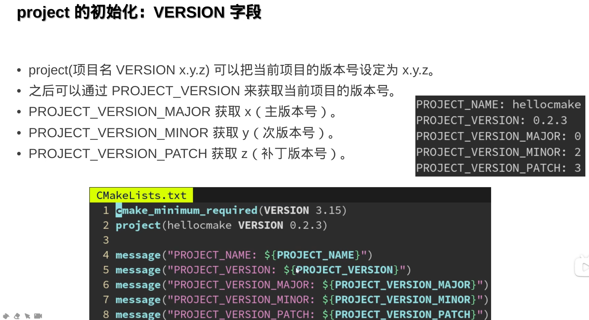
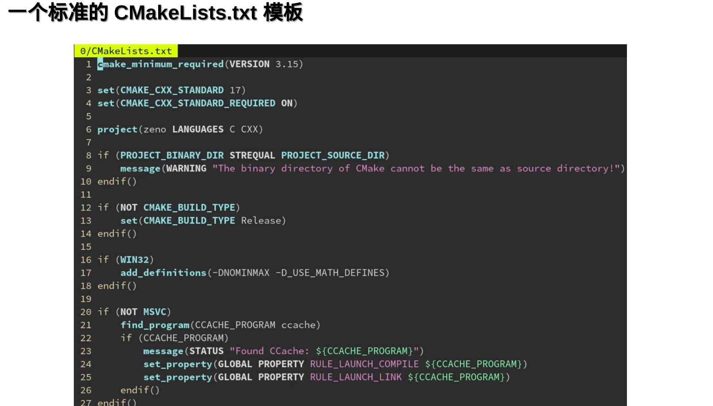
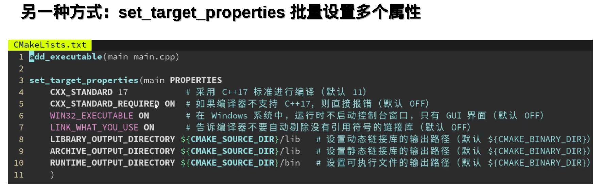
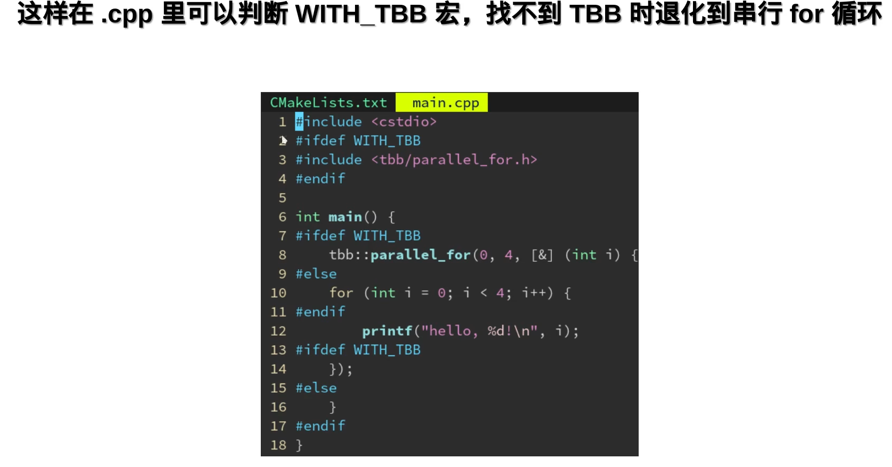
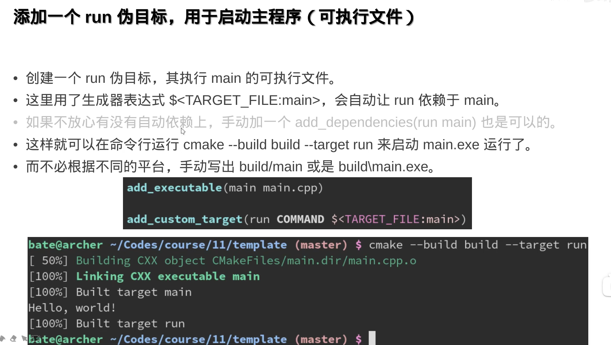

## GitBook总结

- 命令？
- 变量？
- 使用标准？
- 动态静态？

## 编译器

------


------


多文件编译与链接

------


------

注意：这里进行多文件编译的时候，hello函数的声明是在main.cpp文件中的。


## 链接库

```shell
# 查看可执行文件的动态链接情况
ldd a.out
```

### 库

------


------

静态库：

- 可以理解为若干.o文件的打包
- 两个可执行文件链接同一份静态库，每个可执行文件都会包含这个静态库的代码，成为各自可执行文件的一部分（冗余）
- 因此，使用静态库，不需要运行时查找。生成的.a文件，删除后不影响可执行文件运行

动态链接库

- 动态链接，不仅需要可执行文件，还需要动态库，是多个文件
- 可执行文件运行时，会自动查找动态库文件，根据“插桩”重定向
- 因此，多个可执行文件，可以共享同一份动态库

问题：exe，lib和dll是个啥流程？


## Make VS Cmake

make

------


------


cmake：构建系统的构建系统，即make的构建系统

------


------

cmake可以执行编译器，比如默认g++，可以通过cmake命令修改编译器为clang++。也可以修改c++版本。


问题：我们原来写一些小程序的时候，没有用到cmake和make，也没有手动g++编译，是依赖IDE吗？


## Cmake入门

### 命令: add_executable

------


------


### 命令: add_library

------



------


### C++声明

------


------

问题：这种将hello()声明在main.cpp的方式，和main.cpp直接引用hello.cpp有什么区别？（在cmake书写和编译方面）


### C++头文件

------


------

- 这里提到，c++程序引用c语言头文件是可以的，因为c语言的作者实现了这个场景，这些c语言头文件可以检测到编译器是c++编译器
- PPT中提到，cstdio只是包含函数声明的头文件，真正的函数实现是在libc.so动态库
- 注意 <> 头文件和 "" 头文件的路径搜索区别

问题：循环引用会不会产生什么后果？


### 命令: add_subdirectory

------


------

- 这里第三张PPT的意思是，项目对hellolib库添加头文件搜索路径为当前路径，这样引用了hellolib库的文件，也都拥有该头文件搜索路径，也就能直接找到该路径下的.h文件（类似传递）
- （前提是PUBLIC，这里代表头文件搜索路径可传递，或可传播）
- . 代表当前路径，这里就是子模块所在文件夹。

问题：main.cpp这一级如何找到hellolib这个库的？含有子模块需要cmake几次？

### 其他命令

------


------

- PUBLIC 和 PRIVATE 在这里的作用还是可传播和不可传播
- 上半块的命令是target，即对指定目标有效；下半块，对所有目标有效


### 第三方库

#### 引入

------


------

- 注意三种引入方式的实现和优缺点
- 预安装可以解决菱形依赖的问题。比如第二种方式中，spblog本身依赖fmt，如果项目同时依赖spblog和fmt，就会产生头文件章节中提到的菱形依赖

问题：在介绍子模块引入的时候，视频例子中的fmt引用，用的是<fmt/core.h>，他不是说子模块是在工程根目录嘛？怎么去系统目录里面找？

#### 包管理器

------


------

问题：我们平时在linux上编程C++，用的是什么包管理器？ubuntu用的就是apt嘛？


## 现代Cmake

###  对比

------


------

问题：回看光斑项目。使用opencv的时候，list了吗？还是仅仅find package了？


### 0 选项

------


------


### 1 添加源文件

#### 单一源文件

1.  创建目标的同时，添加源文件
2.  先创建目标，再添加源文件

------


------


#### 多个源文件

1.  直接添加多个源文件
2. 使用中间变量

------


------


#### 技巧

1.  .h文件也当作源文件进行添加
2.  GLOB自动查找指定扩展名文件
3.  子文件夹源码添加

------


------


### 2 项目配置变量

#### cmake_build_type

------


------


#### project dir

------


------

问题：子文件夹/子模块的区别在于？配合链接库文件的两种基本方式（cmakelist的编写，是否需要头文件引入）


#### project language

------


#### cxx_standard

------


------


#### cmake_mini_req

------


------


#### others

------




------


#### 标准模板

------



------


### 3 链接库文件

#### 两种基本方式

1. 库文件直接声明在add_executable之中
2. 创建库，再链接

------


------


#### 静态库的问题

------


------


#### 默认参数

------


------


#### 动态不引静态

------


------

- 上述问题还可以通过将静态库改为对象库，用于动态库的引用，进而解决
- 第二张图是针对所有target进行属性设置；第三张图是针对指定target进行属性设置

问题：我们再add_lib的时候，要不要加上.h文件呢？


### 4 对象的属性

#### 设置属性

------





------

- 再次强调：
  - 不要使用“-std=c++17”， 而应该使用 CXX_STANDARD 17
  - 不要使用"-arch=sm_75"，而因该是用CUDA_ARCHITECTURE 75


#### win使用动态库

------


------


### 5 链接第三方库

#### 直接链接

------


------


#### find_package

------





------


### 6 输出信息

#### message

------


------


### 7 变量与缓存

#### 缓存的影响

------


------

- 这里提到一种场景，原来没有某个包，find_package没有找到，cmake就缓存了没有找到的结果。所以装上这个包后，最好删除缓存文件，或者整个build，以清除缓存


#### 设置缓存

------


------

- page105的问题和98本质一样，因为option只是set的一种别名，连续两次set，第二次失效；那么连续两次option，第二次也会失效
- page98/page105的问题也可以通过删除缓存文件/删除build文件夹来解决


### 8 跨平台与编译器

------


------

- page112注意缓存问题


### 9 分支与判断

------


------

- 注意page116表达的隐患
- cmake文件内部的变量名是区分大小写的


### 10 变量与作用域

------


------

- Linux命令行中运行env，可以查看所有环境变量


### tips

------





------

