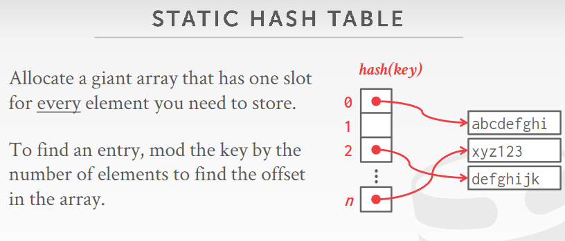
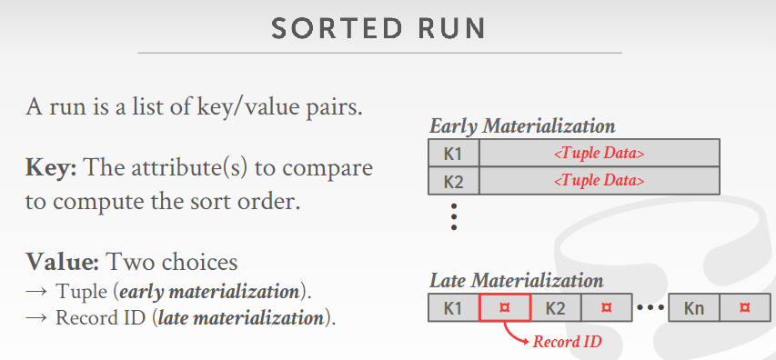
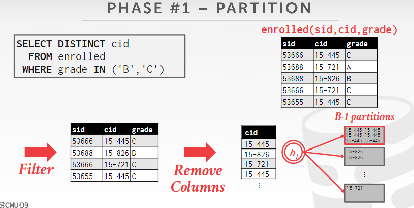
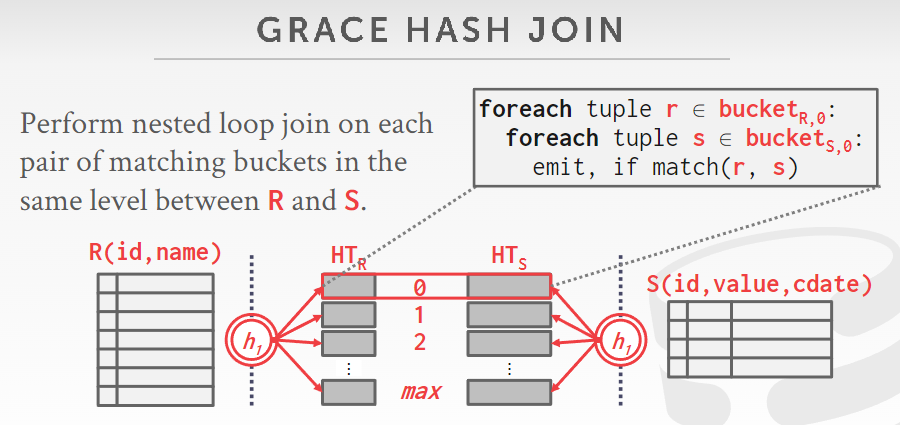
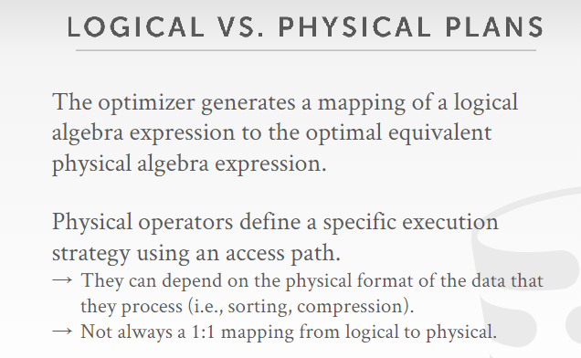
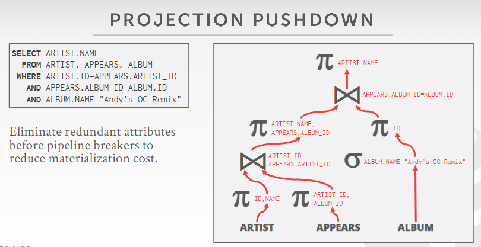
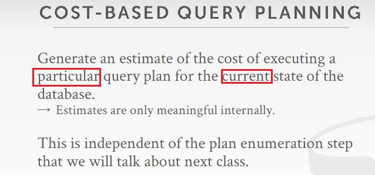
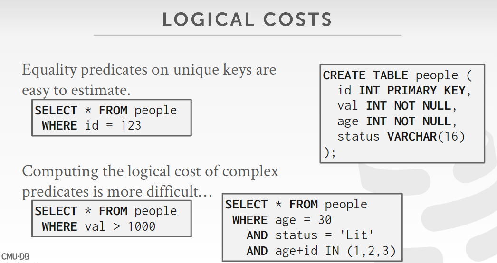
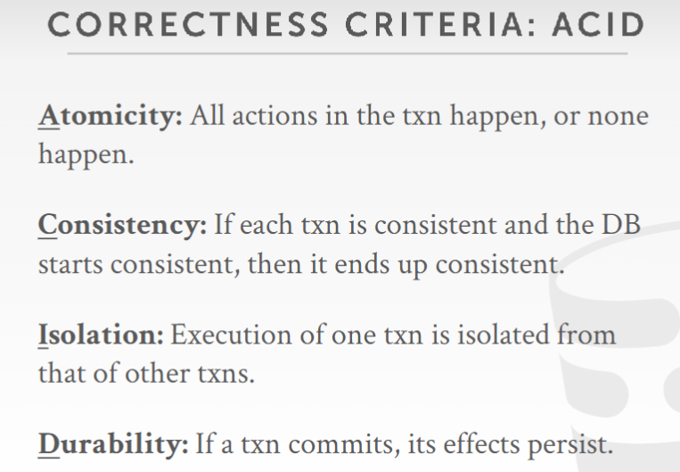
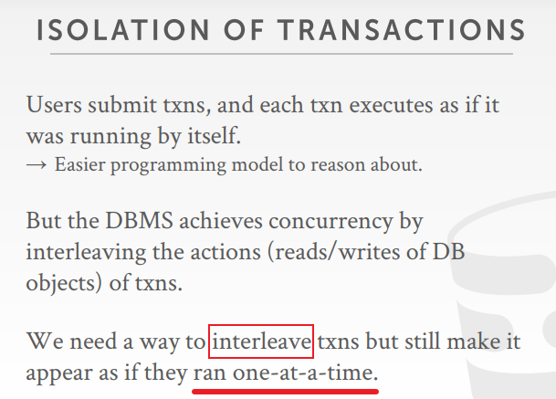

# CMU-15445  2021

需要补充：

- B+树部分的实验
- 2022年课程的新章节（**Storage Models & Compression**）

优秀笔记

- https://zhenghe.gitbook.io/open-courses/
- https://www.jianshu.com/nb/36265841

## 1.Introduction

### csv文件存储数据

这种方式存在很多问题。

在**数据完整性**上

1. 我们该如何确保这个音乐家对每个专辑 都是同样的那个音乐家呢？
2. 如果有人在出道日期上写了个‘哈哈哈’，怎么办呢？
3. 我们要如何存储多个音乐家合作发布的专辑呢？
4. 如果我们删除有专辑的艺术家会发生什么？

在**实现**上

1. 如何找到一个特定的条目？
2. 有一个新的APP 想用同一个DB，怎么办？
3. 2个线程同时写同一个文件怎么办？

在**持久化**上

1. 如果在我们的程序更新记录时机器崩溃怎么办？
2. 如果我们想在多台机器上复制数据库以获得高可用性，该怎么办？

这就引出了我们数据库管理系统（DBMS）


### DBMS

**data model**:数据模型是用于描述数据库中的数据的概念的集合。

**schema**: 模式是使用给定数据模型对特定数据集合的描述。

常见data model


关系模型三要素：

1. structure结构：关系的定义及其结构内容
2. integrity完整性：确保数据库的内容满足限制
3. manipulation操纵：如何访问和修改数据库的内容


### SQL

数据操纵语言（Data Manipulation Language, DML）是[SQL](https://links.jianshu.com/go?to=https%3A%2F%2Fbaike.baidu.com%2Fitem%2FSQL)语言中，负责对数据库对象运行数据访问工作的指令集

**对于SQL语言的理解：**

- 从sql语句到执行计划，可以类比高级语言到机器语言，都是为了让人类专注于high level，high level到low level的转换由编译器负责
- sql是声明式的语言，他只指定需要什么数据，而不是如何找到它。查询计划的指定和优化交由DBMS


### relational algebra

- 非声明式语言对应relational algebra；(how,Procedural) 
- 声明式语言对应relational calculus；(what,Declarative,eg:sql)

特点：

-  relational algebra 基于 set algebra (no duplicates), 但 SQL 基于 bags (duplicates) ，尽管两者都是无序的
- relational algebra 定义了如何计算查询的高级步骤
- relational algebra 会影响 query optimization + execution
- 关系模型的实现，独立于任何查询语言

略过一些基本的关系代数操作。


## 2.Intermediate SQL

### 关系语言组成

- Data Manipulation Language (DML)
- Data Definition Language (DDL)
- Data Control Language (DCL)


### sql解析顺序

[sql语句被处理的顺序：](https://blog.csdn.net/weixin_44404350/article/details/116861936)


when where predicate is evaluated 还没有计算 avg_gpa


### 聚合函数

聚合函数基本只能在select语句的输出列表出现，且返回**单一值**


COUNT, SUM, AVG support DISTINCT


### Group By

因为基于e.cid进行group by操作，所以select的输出列表中可以有e.cid


### Having

对比下面三张图


### String

不同标准的SQL，对字符大小写敏感情况和单双引号情况


函数：

- LIKE（%，_ ）
- SUBSTRING
- UPPER  /  LOWER

字符串连接


### 输出重定向

Store query results in another table:


Insert tuples from query into another table:


### Nested Query

非关联子查询 和 关联子查询

关键字：

- ALL
- ANY
- IN： Equivalent to '=ANY()' 
- EXISTS

典型的相关子查询：外部查询执行一行，子查询就执行一次


### window function

ROW_NUMBER()


RANK()


### CTE

cte(recursion)

union all不去重复？？？

```sql
WITH RECURSIVE cteSource (counter) AS (
(SELECT 1)
UNION ALL
(SELECT counter + 1 FROM cteSource
WHERE counter < 10)
)
SELECT * FROM cteSource
```


```sql
with CTE as(
select id,parentId,name from family where name='爸爸'
union all 
select family.id,family.parentId,family.name from family 
 join CTE  on  family.parentId=CTE.id
) 
select * from CTE
```


## 3.Storage 1

### disk-based

- 假设非易失存储为数据库的主要存储
- DBMS组件控制易失存储和非易失存储之间的数据交换

DBMS的分层结构（上层不需要知晓下层的具体实现，只关注下层提供的API）


### sequential vs random access

在非易失存储上，顺序存取远快于随机存取

- 通过算法减少随机写入的次数
- 同时分配多个页面


这种磁盘和buffer pool之间的page交换，类似于操作系统中的 虚拟内存 


### why not os

**so why not use the os?**

```
The DBMS can use memory mapping (mmap) to store the contents of a file into the address space of a program

The OS is responsible for moving the pages of the file in and out of memory, so the DBMS doesn’t need to worry about it

#下面这个多线程场景是什么意思，能不能根据最下面的四点详细举例说明为什么BP更好？？？
What if we allow multiple threads to access the mmap files to hide page fault stalls?

This works good enough for read-only access.
It is complicated when there are multiple writer.

→ madvise: Tell the OS how you expect to read certain pages.
→ mlock: Tell the OS that memory ranges cannot be paged out.
→ msync: Tell the OS to flush memory ranges out to disk.


DBMS (almost) always wants to control things itself and can do a better job than the OS.
→ Flushing dirty pages to disk in the correct order.
→ Specialized prefetching.
→ Buffer replacement policy.
→ Thread/process scheduling.
The OS is not your friend.
```

bp always exactly knows what the queries are trying to do,it knows what the workload looks like and it can make the best decision 

the os just can see a bunch of read and write calls but know nothing


------

**Problem #1: How the DBMS represents the database in files on disk**

file storage -> page layout -> tuple layout

------


### File storage

DBMS将数据库存储为特定格式的一个或多个文件，OS并不理解文件的内容

storage manager / storage engine：维护数据库文件

有些存储管理器可以调度读写请求，以优化page的时空局部性

storage manager organizes the files as a collection of pages.
→ Tracks data read/written to pages.
→ Tracks the available space

#### pages

通常而言，每个page中的data type都是唯一的，不会mix（tuple,index,log）

self-contained: 描述page的metadata需要存储在page中

每个 page 都有唯一ID
→ The DBMS uses an indirection layer to map page IDs to physical locations.

here are 3 different notions of "pages" in a DBMS:
→ Hardware Page (usually 4KB)（ storage device 提供）（atom writes to storage device）
→ OS Page (usually 4KB)
→ Database Page (512B-16KB)
A hardware page is the largest block of data that the storage device can guarantee failsafe writes.

Database Page和OS page有什么关系吗，和Hardware Page呢？？？


#### database heap file

page storage architecture


database heap file

- tuples are stored in random order
- 2 ways to represent a heap file: Linked List && Page Directory

##### Linked List


问题？？？：

- dbms怎么知道用户检索数据所对应的page id（知道page id之后就能从内存中找到或者从磁盘取到内存）
- 如果堆文件是无序的，那么同一个table 的数据是否能存储在同一个page或者两个指针相邻的page中呢
- 一个page中是否会存储两个table的数据，同一个file中呢

##### Page Directory


### Page layout

代表 how to organize the data inside of the page

- 通常，每个page由header和data组成
- some dbms require pages to be self-contained


#### Tuple-oriented

##### Strawman Idea


##### Slotted pages

当删除tuple的时候，可以在page内部移动tuple并修改相应的内部指针，但对upper levels是透明的，他们还会去同样的位置寻找指针，只不过是指针的指向变了


##### record ids

每个 tuple 都有唯一的 record id

通常而言：**tuple id / record id** = page_id + offset / slot


#### Log-structured

##### log records

- 只存储 log record，且 append only
- fast write because of sequential access
- 基础结构对write非常友好，但是对read不友好


尝试比较这种方式与数据库内核杂谈(2)中的特性二csv+slot_table的区别？？？

优化思路

1. Build indexes to allow it to jump to locations in the log
2. Periodically compact the log

##### compaction


### Tuple layout

代表 how to representation data in tuple

#### tuple data

tuple 本质就是字节序列，DBMS负责将其解释为针对属性类型的值


- visibility info可以参考数据库内核杂谈
- tuple的schema信息通常不需要存储在tuple内部，因为这个信息可以在page header中找到
- 但是类似json db或者document db则需要在每个tuple内部存储schema元数据，因为这些db中每个tuple的格式都可能是不一样的
- 属性通常按照您在创建表时指定的顺序存储；但是如果不按照此顺序存储，可能会更高效


#### denormalize


## 4.Storage 2

### data representation in tuple

个人问题：下面这两个数据类型对应中文是什么；arbitrary precision numbers和fixed-precision numbers是一个东西吗？；到底哪里是fixed，哪里是variable？？？

#### variable-precision numbers

按照IEEE-754 Standard直接存储 / "native" C/C++ types

fixed-length binary representation（定长）

由于与CPU指令的契合，variable precision numbers 通常比 arbitrary precision numbers更快，但可能存在舍入错误（误差）

eg : FLOAT, REAL/DOUBLE


#### fixed-precision numbers

具有（可能）任意精度和比例的数值数据类型。当舍入误差不可接受时使用

 Fixed-point Decimals

exact,variable -length binary representation with additional meta-data（变长）

eg : NUMERIC, DECIMAL


Fixed-point 是在real的基础上添加额外的元数据并在计算的时候进行额外的操作吗？？？


real的加法计算仅仅需要一条CPU执行，而numeric在postgres中则是一长串代码


#### large value

overflow storage page


#### external value storage 

large value仍旧是存储在dbms的若干page中，而external value storage 则存储在dbms外部，dbms仅保存该数据的路径或指针

large value的读速度通常而言要快于external value storage，毕竟存储在DBMS内部


### system catalogs


### database workloads

#### 概述

It is important to choose the right storage model for the target workload（场景负载与存储选择）


#### OLTP/NSM

OLTP ：Simple queries that read/update a small amount of data that is related to a single entity in the database

适合行存储


#### OLAP/DSM

OLAP ：Complex queries that read large portions of the database spanning multiple entities

适合列存储


## 5.Buffer Pool

------

Problem #2: How the DBMS manages its memory and moves data back-and-forth from disk.

------

### 目标

- 尽可能连续读写磁盘，减少随机读写
- 尽可能减少与磁盘交互


### page table

frame：位于内存，与磁盘page大小一样

page table： keeps track of pages that are currently in memory；同时维护每个page的其他元数据（脏位、pin标记、引用计数等）

对page table的操作需要加锁（并发问题）


dirty flag：标志内存中页面是否被修改过，修改后就成为了脏页面（通常还要记录是谁修改了此页面，为了log）

pin/reference Counter：记录正在读/写此内存中页面的线程数


### locks VS. latches


lock(higher level concept)：whole table ,index,tuple 

latch：internal data structure（critical sections / mutex）


### page table VS. page directory


### allocation policies


### BP optimization

#### multiple bp


- 可以为每个BP应用不同的置换策略
- reduce latch contention（提高并发度 ）
- improve locality

实现：


##### object id

同一个page，最好一直映射到同一个BP


问题：object id是record id的一部分？上层不该只能从table name得到page id吗？record id又是怎么知道的？不应该是先把page取到内存，再得到这个page里面tuple的record id吗？？？

##### hashing

直接从page id哈希/映射到BP


#### pre-fetching

##### sequential scans

通常对sequential scans， OS可以做到pre-fetch，但是对Index Scan， OS做不到


##### index scans

此场景，os可能会预取page1、page2、page3、page4等（这其中显然有我们不想要的page，反而有可能降低性能），但是BP知道这是一个对索引的查询，所以可以预取page1、page3、page5


#### scan sharing


If a query wants to scan a table and another query is already doing this, then the DBMS will attach the second query's cursor to the existing cursor.


#### BP bypass


主要专注于连续scan的场景


### OS page cache

OS page cache意味着，将一个page从disk中读取出来，不仅在BP中会存在一份copy，而且会在file system或 os page cache中存在一份copy，即DBMS直接使用OS API，将可能导致内存中存在两份page的copy

如果DBMS使用direct I/O，则可以bypass os page cache，即内存中只有BP中有此page的备份，os不会再维护一份此page的备份

os page cache的缺点

- Redundant copies of pages
- Different eviction policies
- Loss of control over file I/O


### Buffer replacement policies

goals:

- correctness：不要移出被pin的page
- accuracy：最好移出当前看起来最没用的page
- speed
- meta-data overhead

#### LRU


#### CLOCK

LRU与CLOCK的思想都是基于：如果一个page刚刚被访问，那么它很可能在未来一段时间内再次被访问。


##### sequential flooding

LRU and CLOCK replacement policies are susceptible to **sequential flooding**（因为在顺序扫描场景中，最近被使用的page，恰恰是最不需要保存在BP中的page）


#### LRU-K

记录每个page的K个历史访问记录（时戳），然后通过历史记录预判DBMS下一次访问该page的时间。下一次访问时间最远的page将会被移出BP


#### Location

根据具体的查询选择待换出的page


#### Priority hints

DBMS can provide hints to the buffer pool on whether a page is important or not.

比如，下图中 index-page0 显然是最重要的，因为他是和id有关的索引查询的入口


### Ditry page


### Other mem_pool


## 6.Hash Tables

问题：

- b+树和hash table是用在哪一环节（索引数据/BP数据？page_table_？），存在内存还是磁盘？？？
- 分析unorder_map和polar官方代码的，哈希函数和schema

应用场景


design decision


### hash table


static hash table的存在是有假设条件的




### hash的关键决定


问题：

- unorder_map是static hash吗？感觉不是？，unorder_map是动态变化的
- 不同的hash之间，是不是内存占用区别很大（即使所有的value都会被存储）
- 考虑因素：哈希计算速度、冲突概率、内存占用？？？

### hash functions


eg：sha-256、md5；sha-256就是密码学哈希，一般密码学哈希速度都太慢了


问题：

- 这些常见的哈希函数能不能调整输出整数的位数？因为输出32位整数，意味需要2^32个slot？？？还是说一般哈希对应的槽的数量常见为2^32或者2^64?
- 哈希和加密的区别在于，加密需要解密，哈希不用反哈希？？？对比压缩算法呢？https://blog.csdn.net/u010444082/article/details/119353786

### non-unique keys

实际使用情况中，不能保证key是全局唯一的


### static hashing schemes

本章节为了 deal with collisions，下面个各种解冲突方式与哪种哈希函数无关

#### Liner probe hashing


本数据结构中的查找会在命中目标或命中空slot时停止

gaint：意味着slot的数量足够容纳kv对


delete problem

删除C之后，会发现D的查找遇到问题（找到空的slot，会终止顺序扫描）


解决方法1


解决方法2

但是如果从D开始后面的所有kv对都前移的话，还是有问题。就比如B会从最开头移动到最后（这个结构是循环的），这导致B的查找出现问题


#### Robin hood hashing


eg1


eg2


个人想法：这种方式的delete probolem的解决，可以沿用liner probe的两种方式，在方法二中，仅移动空slot之前或者[0]slot之前的kv对即可

#### Cuckoo hashing


这种方式可能会陷入无限循环，当检测到无限循环时，就是该resize的时候


### dynamic hash schemas


#### 	Chained hashing


#### Extendible hashing


桶分裂！！！


####  Linear hashing


虽然是bucket1溢出了，但是split pointer指向bucket0，那么分裂bucket0，并应用第二个hash函数


查找：先应用第一个hash函数，得到结果为0，在split pointer前面（代表bucket0已经分裂过），这时如果在bucket0中找得到就命中，找不到则应用第二个hash函数，看是否能找到


查找：如果应用第一个hash函数，得到结果为1，不在split pointer前面（代表bucket1没有分裂过），那么在bucket1中没有找到的话就是没找到，不需要再应用第二个hash函数。


总结：


The pointer can also move backwards when buckets are empty.

### conclusion


hash不适合表索引的原因：

- 当判断key是否存在时，hash需要entire key to look up，但是不能do a partial look up
- 不能找到小于指定key的所有keys（不支持范围查询）

## 7.Trees Indexes 1

### table index


### B-Tree family


### B+ Tree


- 上图例子中，M=3，所以非根node中最多有2个keys；有2个keys显然对应3个非空子节点
- 图上的内部节点含有key=5；应该是之前叶子节点插入过key=5，然后被删除了，但是内部节点的key=5保留下来了

问题：

- M=3，M/2-1是多少？？？应该是0，page118应该是左开右闭


- 红色图标代表指针
- leaf node中，将key和value分离是一种更好的方式（通常value是定长的）
- 二级索引与主键索引相对应（通常此情况下，表里的数据直接放在主键索引里，作为叶子节点的数据页）


- 也就是说B+树里面可能会存储重复的key，因为同一个key可能同时出现在内部节点和叶子节点，但是B树不会存储重复key
- B+树在删除时，如果一个key在叶子节点被删除，这个key可能在内部节点中保留下来
- B树对于多线程的update，花费代价更高

### B+ Tree Select


- 这就是B+树的优点之一，可以使用部分key进行查询，hash则必须用完整key
- 很少有DBMS支持上图情况下的(b=3)的B+树查询


### B+ Tree Insert  

https://www.cs.usfca.edu/~galles/visualization/BPlusTree.html


### B+ Tree Delete


delete5


delete2


### Clustered Indexs


clustered Index


non-clustered Index


### B+ Tree Design

#### Node size   


- index page 和 data page可以用不同的buffer pool交换
- （bufferpool 中 frame可以是page的整数倍吗？？？）
- B+树中，node大小与page大小和frame大小又是什么关系？参考pointer swizzling，每个page对应node？

#### Merge threshold

实际情况中，不一定在less than half full的时候立即merge，因为merge和split代价都很高，split必须要做，但是merge可以延迟，当下次有kv insert到这个node时，相当于省略了一次merge和一次split


#### Variable-Length keys

前三种方式都有明显缺点（访问慢、node大小不固定、浪费空间）


##### key map/indirection


#### Non-unique indexes


#### Intra-node search


### Optimization

#### Prefix compression


#### Suffix truncation


#### Bulk insert

如果建立B+树前，已经获得了若干key，那么对key排序后，从底向上建立B+树，比直接从根节点插入无序key序列建立B+树更高效。


#### Pointer swizzzling

B+树，不同node之间存储相关联的page_id，这样跳转的时候，需要反复查询page_table，由于page_table的latch的缘故，这会导致并发度降低


## 7.Trees Indexes 2 

### Duplicate keys


下图就是approach 1的效果


下图就是approach 2的效果


问题：

- 能不能第一种方案，不加record_id就是任由key重复，像Non-unique indexes里面那样？？？

### Hash index VS B+ index

 hash index只能用于完整key的点查询，但在这方面通常比B+ index表现更优

聚集索引意味着tuples在磁盘上的顺序和该聚集索引是一致有序的；但是类似postgresql中的Cluster关键字，只能做到排序一次，之后的插入仍旧是顺序添加，也就是无序的

### Implict indexes


- 因为val1不是unique的，所以不能被拿来当作外键


### Partial indexes


- 注意上图建立索引的写法，c用来生成table子集，但是索引是建立在（a,b）之上的；所以查询子句可以直接在索引中得到答案


### Covering indexes


### Index include columns


### Functional indexes


### Inverted indexes


### Observation


## 8.Index Concurrency

### Observation


- 今天的章节对应的是Physical Correctness
- Logical Correctness在哪一章节呢？？？
- 这一章只讲B+树的并发控制吗，还是通用到hash table和bp？？？

### locks VS. latches


- locks对应事务，latchs对应线程（一个事务中，可以有多个线程）
- 今天讲述的都是latches的部分，locks在第16章两阶段锁
- latch对应临界区，不需要回滚，因为latch释放标志着临界区操作判定为操作成功，这个操作是原子的
- 结合16章和lab代码实现中的命名，来区分两个概念？？？比如BP中的锁就是latch？

### Latch Implementations


#### Approach #1


#### Approach #2


#### Approach #3


#### Compare-and-swap


### Hash table latch


- page latch的总数量更少，但是会降低并发度
- 这里为什么会有page的概念？整个hash table太大，一个page放不下吗？？？还是说这里的page更像bucket？

#### page latch


- T1在找到page2之前，释放page1的锁是安全的，因为这里的场景是static hash table，不会resize
- 在b+树中，从一个node跳到另一个node之前，则需要保持原来node的latch

#### slot latch


#### no latch

基于compare-and-swap操作，实现并发控制，不需要latch


### B+ Tree CC


#### Example

 错误场景


#### Latch carbbing/coupling


- 当ancestors的latches可以释放的时候，应该先释放高层的latch，因为他们锁定的区域更广
- 新生成的node也要锁上，直到insert操作完全结束。因为可能有其他操作在顺序扫描leaf

#### Better latch

此策略同样需要在拿到下一个node的latch后，才能释放当前node的latch


- 这种方式在第一次尝试过程中，跳到child node后，不需要判断是否safe，跳到child node后即可释放parent node的R-latch

#### Leaf node scan


- 获取锁失败时，就kill iteself，然后重启，这样能避免死锁，也方便代码实现
- 注意代码中到底是如何实现top-down和leaf node scan的逻辑的？？？

#### Delayed parent update


## 9.Sort & Aggregate

### Query plan


### Sort


#### External merge sort





注意：

- B=3，就是两路外部归并排序
- B=K+1，就是K路外部归并排序；上例B=5，所有runs的大小变化过程：5->20->80

#### Using B+


注意：

- 只有聚集B+树索引，才能拿来进行排序
- 非聚集B+树索引，排序效果不如external merge sort

### Aggregations

如果查询结果要求有序，且排序属性和聚合属性相同，那么可以直接用sort来进行聚合；但是，如果查询结果不要求有序，那么hash is better


Hash Aggregate


#### External Hash Aggregate





- 通常而言，可使用的buffer pages的数量由DBMS来决定，那就可能出现B-1小于hash结果数量的情况，暂时没有提到解决方案
- 当某个partition的容量超过了一个page大小后，先写入磁盘，并在内存记录此partition和page的关系，再分配一个新的buffer page为此partition使用。这样第二阶段就能找到所有属于此partition的pages
- 第一阶段，do not care collsions


## 10.Join Algorithms


### Join Operators


Approch1


Approch2


-  更适合列存可以理解为：从磁盘读取的时候，就只取出join属性列和record id。因为行存一开始从磁盘读取的时候就必须读出一整行，这时候直接投影就好了

Cost Anylysis


### Stupid Nested Loop Join


- 根据这个Cost的公式，我们得出结论：smaller table should be the left/outer table

### Block Nested Loop Join


- 根据这个Cost的公式，我们得出结论：smaller table should be the left/outer table
- We determine size based on the number of pages, not the number of tuples


### Index Nested Loop Join


- 如果Join涉及的属性包含S表上的a,b两个属性，但是仅在a属性上存在索引，那么此join算法也是可行的，只是需要在属性b上多判断一次


### Sort Merge Join


backtrack情形


- 只有inner table才会出现backtrack的情形，outer table不会出现，而是一遍扫过
- 适合sort-merge-join的情形
  - join key attribute本身有序，或者存在聚集索引
  - join的结果需要根据join key attribute进行order by，此join结果本身就有序，不需要额外进行sort

### Hash Join

通常而言，hash join性能最好


- approach 1适合行存；approach 2适合列存


#### Bloom Filters


- 查询结果为key不存在，一定是对的
- 查询结果为key存在，则不一定是对的，需要额外验证
- 如果想实现删除功能，为每一个bit增加一个计数器

#### Probe Hash Optimization


### Grace Hash Join

当outer table 的 hash过程或结果太大，不能完全在内存中进行时，就会用到磁盘，那么后续inner table的tuple做probe就可能出现很多对磁盘的random IO。我们需要尽可能转化random IO为sequential IO

在External Merge Sort 和 External Hash Aggregate 以及 Hash Join中，都存在这样的问题





- recursive partitioning同样可以应用于Hash Aggregate


### Conclusion


## 11.Query Planning

### Processsing Model


#### Iterator/Volcano Model


- pipelining breaker：图271中，join的left table的操作就是breaker，因为它需要得到child的所有符合条件的tuple，才能继续操作，而不能得到child的1个tuple就emit给上层
- 火山模型中，output control比较容易

#### Materialization Model


- 适合OLTP负载场景

#### Vectorization Model


#### Processing Direction


### Access Methods


#### Sequential Scan


##### Optimization


- Heap Clustering不是Index Scan吗？？？

#### Index Scan


#### Multi-Index Scan


##### Index Scan Page Sorting


- 如果不用索引，直接扫描一个table，可以直接得到此table所在的所有page，直接扫描就行了。但是使用聚集索引就可以通过该索引属性上的条件，过滤得到部分tuple，对于这些tuple所在的page，进行排序后再进行IO
- 将对非聚集索引的顺序扫描的 random IO 变为了 sequential IO
- Index Scan 和 Multi-Index Scan都有可能用到此方法

### Update Query Problem


- 修改数据库的操作，有“责任”去检查约束并且更新索引！！！

### Expression Evaluation


- 比如上图中的，1=1，traverse这个表达式树，是一种浪费


## 12.Query Planning


- 本章节，基于Parallel DBMSs进行讨论，分布式数据库由于通信的不可靠性，产生了许多hrad problems，会在后续的章节中讨论

### Process Model


- 在OLTP场景，并行处理通常指并行处理多个小的请求
- 在OLAP场景，并行处理通常指讲一个大的请求分割为多个小任务，然后并行处理
- workers可以是process或者thread 

#### Process per DBMS Worker


#### Process Pool


#### Thread per Worker


- DBMS使用muti-thread，不代表该DBMS可以进行intra-query  parallelism


### Scheduling


### Query Parallelism


#### Inter-query


#### Intra-query


#####  Intra-Operator (Horizontal)


##### Exchange Opertor


##### Inter-Operator (Vertical)


##### Bushy


### I/O Parallelism


#### Muti-Disk Parallelism


- 将多个物理存储设备抽象成一个逻辑存储设备
- 这对于DBMS而言是透明的

#### Database Partitioning


### Conclusion


## 13.Query Planning 1

 


- 注意这两个大的分类，后面的优化方法大致都可以归为这两类
- 是否可以对应逻辑优化和物理优化？？？





### Relational Algebra Equivalences


### Logical Query Optimization


#### Split Conjunctive Predicates


#### Predicate Pushdown


#### Replace Cartesian Products with Joins


#### Projection Pushdown




### Nested Sub-Queries


#### Rewrite


#### Decompose


### Expression Rewriting


### Cost Model

上面的方式基本都属于Heuristics / Rules，这些优化方式不需要了解数据库的具体信息和内容。

本方式属于Cost-based Search，需要了解数据库当前状态，是基于当前数据库状态对指定查询的代价评估




### Conclusion


## 14.Query Planning 2

### Statistics/Cost Estimation

- 本章节，统计的目的是 评估 costs，尤其是logical cost，即执行结果的tuple数量，所以小误差可以被接受


#### selection cardinality


#### logical cost



- 通常而言，统计信息能过帮助我们预估logical cost，一般指查询结果的大小（元组数量）。唯一键上的等值查询结果的元组数量为0或1

#### selectivity

  

##### example


#### join

这里假设inner table中的每个键都将存在于outer table中。在包含外键的join中，符合这里的假设条件，但是大多数其他join操作，并不符合这里的假设。


#### assumptions


#### break assumption

condition 1


condition 2


- 如果对每个distinct value存储它的数量，将会占用很大的空间


- 上面两个图，代表对图378的两种改进方式
- 基于这两种划分bucket的方式，都可以在每个bucket内部，用平均值代表bucket中每个distinct value出现的次数

#### sketches


#### sampling


### Plan Enumeration


- 本章节重点关注single relation 和 multiple relations

#### Single relation


#### Multi-relation

multi-relation通常离不开join操作

##### left-deep join tree


- 左深树可以 reduce search space
- 左深树，便于流水线化执行，因为每一个join中间结果都立即成为下一个join的input，而不需要写入临时文件
- 但是由于两个base table的join结果就可能超过内存容量，所以左深树并不能完全避免将中间结果写入临时文件。左深树的重要性因此下降

##### alternatives


example 1


##### candidate plan example


#### Postgres Optimizer


- start with random choices

- 怎么pick element和genetic没听懂？？？


### Conclusion


## 15.Concurrency Control Theory


### Transaction




#### A


##### Logging


##### Shadow Pageing


- 这两个措施分别怎么应用，或者应该应用到哪些并发策略中？？？

#### C


- 如何正式表示：数据库的一致性状态？？？
- 转账问题是原子性的体现不是一致性的体现


- 在分布式系统中，如何使得未来的事务能够看到已经提交事务的改动，将会是一个挑战。
- 单机数据库会简单一些。
- 如果事务A正在运行，事务B开始，且二者读写的数据有冲突，在单机数据库和分布式数据库中分别应该怎么处理？？？


- 事务一致性由程序来负责，而不是DBMS来负责？？？
- 例子：只有选了这门课的人可以看到系统里面的这个作业。这只能由程序来控制，因为数据库本身允许任何用户看到这个作业（这个例子合适吗？） 

#### I



- 编程的时候只考虑单线程编程
- 交叉-->可串行化
- 单线程编程又怎么修改交叉的顺序呢？？？

##### concurrency control


- 感觉A与C可以在单线程下理解，到I再在多线程下理解。
- Latch保护数据结构中的数据，比如hash table 和 B+树
- Lock保护数据库对象

##### Interleaving schedule

如何判断两个调度等价


- 两个调度是等价的包含两层含义
  - 调度结束后，数据库对象的值完全相同
  - 调度过程中，事务读到的值完全相同

##### conflict


- 读写冲突：dirty reads
- 写写冲突：overwrite


##### conflict serializable

this is about how to generate a correct schedule

构造冲 突可串行化的调度方案


##### Dependency graphs


- 一个调度不是可串行化调度（如上图），但他的执行结果可能是“正确”的，也就是和串行化调度的执行结果相同。

##### View Serializability


- view串行化有什么用啊？？？


