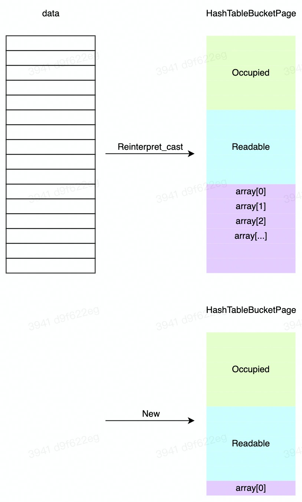

# Project2

## 任务

## 概念

- extendible hash table
  - hash table的抽象表示
  - 包含哈希函数，并能找到directory page
- hash directory page
  - extendible hash table的一部分，存储全局信息，只有一个
  - 像一个“目录表”
  - 存储global depth和所有directory page槽对应的bucket page的page id和local depth
- hash bucket page
  - extendible hash table的一部分，存储真实数据，若干个
- 槽
  - 自定义概念。本project涉及两个槽的概念
  - directory page中的槽
    - 划分bucket用
    - 上限为DIRECTORY_ARRAY_SIZE
    - 一般只用2^(global depth)个

  - bucket page中的槽
    - 存放实际数据
    - 上限为BUCKET_ARRAY_SIZE
- depth
  - global depth：需要global位来判断，key被划分到哪个directory page槽中
  - local depth：表示需要local depth个比特位来判断一个key是否在这个bucket （page）
  - 理论上，global depth为所有local depth的最大值

- bucket id与bucket page id
  - bucket id
    - 在dir page中，是directory page槽的下标
    - 在bucket page中，是bucket page槽的下标
  - bucket page id是每个bucket page的BP page id
- **Split Image**
  - 代码中，split image是directory 槽之间的关系，互为split image的dir槽对应的2个bucket page可以Merge
  - 本project是通过 **低位** 来划分bucket page的，这样更利于编程实现，与cmu课程PPT不同
    - 就比如HASH_TABLE_TYPE::KeyToDirectoryIndex()，低位就好做很多
  - 槽对应的空bucket page只有和split image对应的bucket page的local depth相等时，二者才能合并。不相等一般意味着split image对应的bucket page在和空bucket page完成split之后，又进行了split操作。
- occupied & readable
  - 注意：标志位应该用unsigned char存储，而不是char

  - 单个标志位（比特位）
    - occupied：代表这个槽是否写过，一旦写过就永远为true
    - readable：代表这个槽是否可读，没写过肯定不可读，写过但删除了就也不可读

  - 标志位数组
    - 这是一个unsigned char数组，所以一个unsigned char元素，对应8个槽的标志位。若槽的数量不是8的整数倍，就会有若干比特位没有用。
    - 因此判断和修改标志位就涉及到位操作

  - index & offset
    - index：表示槽对应的标志位在哪个unsigned char中（bucket_idx / 8）
    - offset：表示槽对应的标志位在unsigned char的哪个比特位（bucket_idx % 8）
    - 很显然，0号槽对应occupied_[0]的**最低位**
- BP page与 dir/bucket page
  - ？


## 具体实现

### Directory Page

#### 思路

- 管理和存储 global depth
- 管理和存储所有directory page槽所指向的bucket page的元信息（local depth和bucket page id）
- **Split Image的理解和实现是重中之重**

#### 私有成员

```C++
// directory page id
page_id_t page_id_;

uint32_t global_depth_{0};

// 槽所指向的bucket page的local depth
uint8_t local_depths_[DIRECTORY_ARRAY_SIZE];

// 槽所指向的bucket page的page id
page_id_t bucket_page_ids_[DIRECTORY_ARRAY_SIZE];
```

#### 关键函数

```c++
uint32_t GetGlobalDepthMask();
// 用于 位操作，函数结果为获得global depth个1，用于截取低位
// 将key对应到指定的directory page槽
```

```C++
uint32_t GetLocalDepthMask(uint32_t bucket_idx);
// 用于 位操作，函数结果为获得local depth个1，用于截取低位
// 仅仅被GetSplitImageIndex()调用
```

```C++
uint32_t GetSplitImageIndex(uint32_t bucket_idx)
// 获得 bucket_idx 对应的 Split Image
// 举例：bucket_idx=011, local depth=3，那么split image应该是111
// 实现：将bucket_idx的低(local depth-1)位不动，第local depth位取反
// 与0异或，不变；与1异或，取反
```

```c++
bool CanShrink();
// 判断一个hash table是否可以收缩
// 如果所有 bucket 的 local depth 都小于 global_depth，那么可以 global_depth--
```

### Bucket Page

#### 思路

- 注意bucket page中仅有数据和标志位，没有任何额外信息
- 这就意味着bp中的一个page的数据部分，也就是Page_Size的大小，将会全部被数据和标志位占有
- 注意occupied & readable的含义和控制策略

#### 私有成员

```c++
// 对于标志位的存储而言，unsigned char 比 char 更适合
// 标志对应槽是否被占用
unsigned char occupied_[(BUCKET_ARRAY_SIZE - 1) / 8 + 1];
// 0 if tombstone/brand new (never occupied), 1 otherwise.
// 标志对应槽是否可读
unsigned char readable_[(BUCKET_ARRAY_SIZE - 1) / 8 + 1];  // 偏移量为0的标志位是存储在低位的

// 本质是一个指向内存空间的指针，将在逻辑问题章节详述
MappingType array_[0];  
```

#### 关键函数

```C++
bool Insert(KeyType key, ValueType value, KeyComparator cmp);
// 插入kv对
// 实现
// 1. bucket page满了，不能插入；kv对已经存在，不能插入；key存在，但是value不同，则可以插入
// 2. 遍历找到第一个不可读的槽，放入kv对，设置该槽可读，已占用。
```

```c++
bool Remove(KeyType key, ValueType value, KeyComparator cmp);
// 删除kv对
// 实现
// 1. 遍历bucket page，如果找到了一样的kv对，就设置该槽为不可读，因为一个bucket page中，不存在完全相同的kv对，这时就可以返回结果了。
// 2. 如果没找到一样的kv对就读到了未占用的槽，直接结束遍历，返回false
```

```c++
bool GetValue(KeyType key, KeyComparator cmp, std::vector<ValueType> *result);
// 查找key的所有value
// 实现：
// 1. 遍历所有的bucket page槽，如果槽是可读的，就判断槽中的key，若和查找的key一样，则将槽中的value放入结果集
// 2. 如果槽不可读。若槽被占用了，就继续遍历，若槽没被占用，直接跳出遍历。因为后续的槽都没有被占用。
```

```c++
bool IsOccupied(uint32_t bucket_idx);
// 判断下标为bucket_idx的槽的标志位
// 实现
// 1. 计算index和offset确定标志位的位置
// 2. 按位与操作，获得该标志位的值
occupied_[index] & (1 << offset);
```

```c++
void SetOccupied(uint32_t bucket_idx, int bit);
// 设置下标为bucket_idx的槽的标志位
// 实现
// 1. 计算index和offset确定标志位的位置
// 2. 若设置为1：按位或操作，仅修改标志位为1
occupied_[index] |= 1 << offset;
// 3. 若设置为0：按位与操作，仅修改标志位为0
occupied_[index] &= ~(1 << offset);
```

```C++
bool IsFull();
// readable_中
// 1. 除了最后一个元素，所有的unsigned char是否等于0xff
// 2. 最后一个unsigned char再单独判断
```

```C++
bool IsEmpty();
// readable_中，所有的unsigned char元素都等于0，才empty
```

```C++
uint32_t NumReadable();
// 这个函数包含了如果确定一个unsigned char中1个数的操作
n = readable_[i];
while (n != 0) {
    n &= n - 1;  // 将最低位1清0, 计算1的个数
    cnt++;
}
```

### Extendible HB

#### 思路

- 四个操作：insert、remove、split和merge
  - insert、remove仅仅修改bucket page内部数据，所以对directory page是读操作
  - split、merge涉及到directory page数据的改动，是写操作
  - split和merge的操作会比较复杂
- 不要忘了UnpinPage()，占用与释放的对应关系要正确
- 我的策略是插入不下的时候，进行SplitInsert，和直接满了就Split相比不晓得区别大不大？

#### 私有成员

```C++
page_id_t directory_page_id_;
BufferPoolManager *buffer_pool_manager_;
// key比较器
KeyComparator comparator_;

// Readers includes inserts and removes, writers are splits and merges
// 注意哪些操作算读，哪些操作算写
ReaderWriterLatch table_latch_;

// 哈希函数
HashFunction<KeyType> hash_fn_;
```

#### 关键函数

```C++
ExtendibleHashTable();
// 构造函数，迄今为止最复杂的构造函数
// 实现
// 1. 为dir page申请一个BP page
// 2. 将该BP page的数据部分，转为<HashTableDirectoryPage *>指向的空间，获得dir page
// 3. 创建两个bucket page，建立dir与bucket的关系，初始化local depth、global depth、page_id等信息
// 4. 释放对1个dir page，2个bucket page所对应的3个BP page的占用（UnpinPage()）
```

```C++
uint32_t KeyToDirectoryIndex(KeyType key, HashTableDirectoryPage *dir_page);
// 判断key被划分到哪个directory page的槽
// 实现：
// 对Hash(key)截取低global depth位
Hash(key) & dir_page->GetGlobalDepthMask();
```

```C++
HashTableDirectoryPage * FetchDirectoryPage();
// 根据directory_page_id_取出对应的BP page，再将BP page的数据部分，转为HashTableDirectoryPage对象
reinterpret_cast<HashTableDirectoryPage *>(buffer_pool_manager_->FetchPage(directory_page_id_)->GetData());
```

```C++
std::pair<Page *, HASH_TABLE_BUCKET_TYPE *> HASH_TABLE_TYPE::FetchBucketPage(page_id_t bucket_page_id);
// 这个函数拿出来，就是用来理解这两个返回值的区别
// 原来的代码只有一个返回值，但是两个返回值都有用，并且每算一次都要FetchPage()一次，对应地要UnpinPage()一次，所以不如调用一次函数将两个函数都返回
```

```C++
bool GetValue(Transaction *transaction, const KeyType &key, std::vector<ValueType> *result);
// 主要用来理解加锁
// 详见逻辑问题-并发控制
```

```C++
bool Insert(Transaction *transaction, const KeyType &key, const ValueType &value);
// 插入一个kv对
// 实现：
// 同样注意加锁策略
// 1. 尝试向指定bucket page中插入
// 2. 如果插入成功，或是因为kv对重复而失败，则释放dir page和bucket page对应的2个BP page，并释放所有的锁，直接返回
// 3. 若是因为bucket page满了而失败，则释放页面占用和锁占用，触发Split Insert()
```

```C++
bool Remove(Transaction *transaction, const KeyType &key, const ValueType &value);
// 删除一个kv对
// 实现
// 同样注意加锁策略
// 1. 尝试在指定bucket page中删除
// 2. 如果删除成功，并且删除后bucket page变为空，则释放页面占用和锁占用，触发Merge操作
// 3. 否则，释放页面占用和锁占用，直接返回
```

```C++
bool SplitInsert(Transaction *transaction, const KeyType &key, const ValueType &value);
// 不仅要Split还要Insert；针对某个bucket page进行split
// 实现
// 1. 扩展哈希表：
// 不一定要扩展(如果global depth > local depth就不用扩展)
// 如果需要扩展，那么哈希表翻倍，新增的dir槽指向原来的bucket page，修改global depth
// 2. 新增bucket page，并修改所有向old bucket的dir槽：
// 遍历所有的有效dir槽，如果指向old_bucket，就看是否需要修改指向新的bucket page，并修改local depth
// 3. 在新旧bucket page之间划分数据
// 4. 释放所有的BP page占用和锁
// 5. 触发Insert()
```

```C++
void Merge(Transaction *transaction, const KeyType &key, const ValueType &value);
// 不涉及kv对的插入和删除，仅仅是Merge操作；这里实现的是无差别merge，并不是针对某个bucket page进行merge
// 实现
// 如果bucket page为空，且一对split image之间local depth相等，均>1，进入循环
// 1. 开始merge，修改所有指向这两个bucket page的dir槽的信息
// 2. 收缩哈希表
// 3. 释放页面占用和锁，更新bucket_idx 和 split_image_bucket_idx，以检查是否需要级联merge
```

## 逻辑问题

### 项目定位

- 本项目实现的hash table一般是用来做hash **index**的。key指的是索引属性值，value指的是RID
- Bustub是一个关系型数据库，这里面的kv对和kv数据的kv对不是一个概念

**与buffer pool的关系**

- directory page和bucket page都是通过BP Page的数据部分进行类型转换得到的
- 可以理解为dir page和bucket page，通过BP实现持久化和恢复，也就是向磁盘的读写

### Split Image

- split image是directory 槽之间的关系
- split image的计算
- 两步：低(local_depth-1)位不变；第(local_depth)位取反
- 与0异或：不变；与1异或：取反

关于异或操作完成后，是否需要执行截取操作：


### 标志位相关

下面的内容在概念章节&关键函数章节做了阐述，这里汇总一下。

1. 标志位的含义
   - occupied的含义
   - readable的含义
   - 二者的关系以及如何配合
2. 标志位的存储
   - 一个unsigned char对应8个槽的标志位
3. 标志位的读写
   - IsOccupied()
   - SetOccupied()
   - NumReadable()

### 持久化

- Extendible Hash Table不需要持久化
- directory page和bucket page需要持久化。这两个类的对象是从无意义的内存数据块转换类型得到的

### 0长度数组做指针

首先明确一个操作

```C++
auto bucket_page_data = reinterpret_cast<HASH_TABLE_BUCKET_TYPE *>(bucket_page->GetData());
```

- bucket_page代表Buffer Pool中的一个Page
- 也就是说BP中Page的data部分才是和一个HASH_TABLE_BUCKET_TYPE对象完全对应
- 那么一个bucket page的大小就是Page_Size
- bucket page包含的内容只有槽数据和标志位

也就是一个逻辑槽，对应一个槽数据和一个bit的标志位

- bucket page中槽的数量是算好的，那么标志位占用的空间就是固定的
- bucket page中标志位在前，槽数据在后。剩余的空间都是给槽数据用的

```C++
MappingType array_[0];  
```

所以 MappingType array_[0]; 代表了这块空间的开始位置。后面可以直接用 array[1]、array[2]......来访问这块空间



### 构造/析构函数 禁用

```C++
// Delete all constructor / destructor to ensure memory safety
HashTableDirectoryPage() = delete;
~HashTableDirectoryPage() = delete;

HashTableBucketPage() = delete;
~HashTableBucketPage() = delete;
```

不需要的原因

- 注意：directory page和bucket page是不需要构造函数和析构函数
- 因为这两个类的对象，都是从BP Page的内存空间转换类型得到，不会直接new得到，所以不需要构造函数
- 同时这两个类的指针，实际指向的是Buffer pool的内存空间，因此也不需要析构函数

调用的后果

- 调用构造函数会申请一块新的内存空间，但是这块内存空间不被buffer pool管理，也就没法持久化（除非手动memcpy）
- 调用析构函数会将Buffer Pool申请的内存空间释放掉，显然是错误的。

### BUCKET_ARRAY_SIZE计算

- 这个常量代表bucket page中槽的数量上限

```C++
#define BUCKET_ARRAY_SIZE (4 * PAGE_SIZE / (4 * sizeof(MappingType) + 1))
```

- 上面这个表达式不容易理解真实含义。分子分母同时除以4

```c++
#define BUCKET_ARRAY_SIZE ( PAGE_SIZE / (sizeof(MappingType) + 0.125 * 2))
```

- 一个逻辑槽，占用了一个MappingType数据，以及两比特的标志位，也就是0.25字节

### Shrink HB

- merge操作完成后，可能需要收缩哈希表
- 因为dir槽的代码实现是定长数组，所以只需要递减global depth就能实现收缩
  - 不需要删除无效dir槽的映射关系，因为扩展哈希表的时候会直接重写这些槽的映射

- 通过global depth和local depth的含义（两者都代表比特位数），就能明白为什么global depth需要为local depth的最大值

### Split & Merge详述

1. SplitInsert

   - （扩展哈希表）
   - new bucket page
   - 修改dir槽的指向
   - 划分数据
   - Insert()
2. Merge

   - 根据key锁定到空bucket page，找到split image，检查是否能merge
   - merge：更新指向这两个bucket page的所有dir槽的指向和local depth
   - （收缩哈希表）
   - 找到现在的split image的split image，判断是否需要级联merge
3. 时机不同
  - Split在bucket page已经满了，并且再次向其中插入kv对时触发
  - Merge在bucket page变为空时，立即触发

### Split的隐形级联

假设bucket page A已经满了，这是一个新的kv对 t 想要插入其中。很显然会触发split。split后，新产生bucket page B。存在一种情况：A中所有已经存在的kv对和新kv对t，都还是会哈希到bucket page A，bucket page B仍旧是空的。显然这时候，需要继续split

实现中，虽然SplitInsert()函数中没有像Merge()一样的while结构，但是SplitInsert()和Insert()可以相互调用。即SplitInsert()一次后，Insert()仍旧因为bucket page满了而失败，则会再次调用SplitInsert()，以此实现级联split。

### Merge的特殊性

- 级联merge：完成一次merge后，再去找merge后bucket page(A)的split image(B)，判断是否能继续merge。因为B可能之前就变为空了，只是A的local depth比B大，没有merge，现在A的local depth变小了，存在与B merge的可能性


- merge方案
   1. 遍历dir槽，寻找可以merge的对。这种方案效率低，且会漏掉可以merge的对。
   2. 根据split image，寻找merge的对。
   3. （但是两种方案都能通过线上测试）

### UnpinPage()

- num of(Unpin) = num of (New) + num of (Fetch)
- 这三个操作，都是调用Buffer Pool的操作

### ！！并发控制 ！！

涉及到的几个锁

- ExtendibleHashTable中的table_latch_
- Page中的rwlatch_
- BPMI中的latch_

锁的含义

- table_latch_：实现directory page的读写并发控制
- rwlatch_：实现某个内存Page的读写并发控制，其实就是bucket page
- latch_：同一个BPMI，同一时间只能进行一种操作

锁的使用

- table_latch_：对hash table的一个操作（内部：hb操作内部加锁）
  - 整个用读锁锁住：GetValue()、Insert()、Remove()
  - 整个用写锁锁住：SplitInsert()、Merge()
- rwlatch_：对bucket page的若干操作一起加锁（外部，上层：调用bucket page操作之前加锁）
  - 读锁：GetValue()、IsEmpty()
  - 写锁：Insert()、Remove()、IsEmpty()
- latch_：多BPMI的一个操作上锁（内部：BP内部加锁）
  - 略

<font color="red">**思考：**</font>

- hash table和buffer pool都是对外部可用API进行整个加锁；但是bucket page是对自身的若干操作一起加锁
- 感觉hash table和dir page用同一个锁实现并发控制有点取巧，dir page本质和bucket page一样，是否用Page.h的锁会更合理
- 只有hash table的外部可用API的参数中有 Transaction *
- buffer pool可以用更细粒度的锁，来提高并发度，比如fetch和delete可能不冲突
- 猜测两阶段锁协议中的锁和这上面的3个latch没关系。这里就是对数据结构加锁的latch，而两阶段锁协议是对数据库组件进行并发控制的lock

### 其他

- void HashTableDirectoryPage::VerifyIntegrity()干啥的
- directory槽满了或bucket槽满了的情况？？？
  - 两类槽的上限数量在概念章节都做了陈述

## 语法问题

- .cpp文件末尾，一堆template class干啥的
- reinterpret_cast<HashTableDirectoryPage *>，怎么说
- MappingType array_[BUCKET_ARRAY_SIZE+1]，有什么后果？
-  [bucket_page, bucket_page_data] = FetchBucketPage(old_bucket_page_id); 为啥不行
