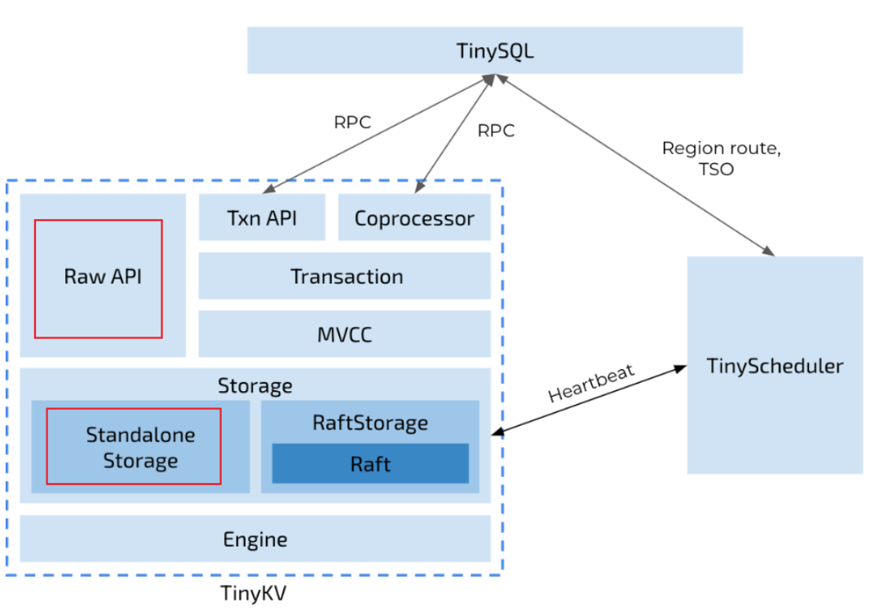
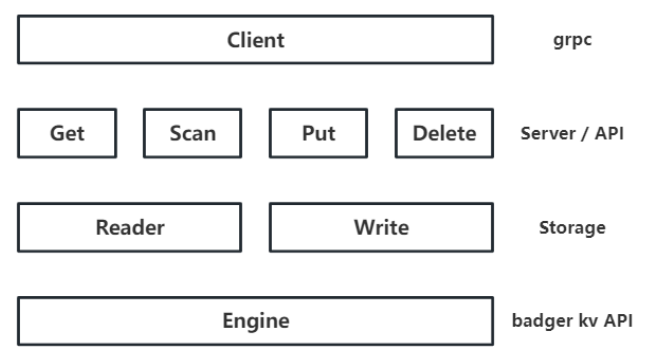
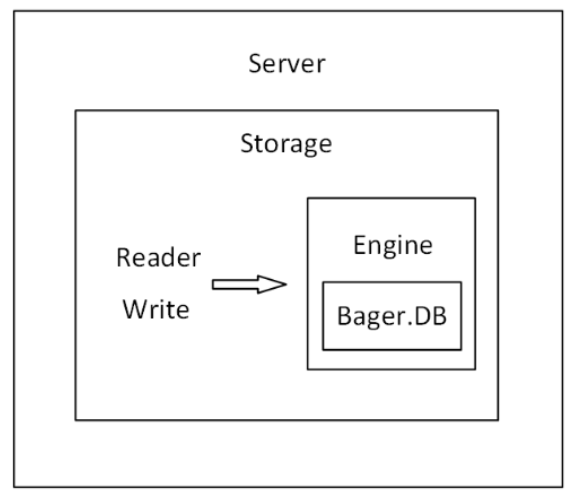
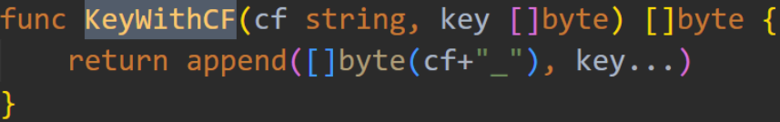

## 项目简介

上图展示了包含TinyKV的集群架构。此架构基于TiDB架构实现，主要分为三部分：TinySQL、TinyKV、TinyScheduler，分别代表计算、存储和调度。因此，该架构的主要特点是存储与计算的分离。

上图中红色方块圈出的模块，对应了Project1的工作。

## 代码架构

上图展示了Project1代码架构，Client即TinySQL。TinySQL会向TinyKV发送grpc request

TinyKV中Server层，负责解析grpc request，调用下层执行请求，再构造grpc response

TinyKV中Storage层，负责实现和维护Column Family，主要有两个函数，分别负责读写请求

TinyKV中Engine层，其实就是badger的封装，负责实际的kv对读写

下图是另一种架构图

## 思考

### Storage层

badger本身就是一个单机kv存储引擎，但是badger不支持column family

tinykv之所以实现storage层，是为了额外支持CF

### CF概念与实现

列族概念在HBase中出现，就是将多个列合并为一个CF进行管理。这样读取一行数据时，你可以按照 CF 加载列，不需要加载所有列（通常同一个CF的列会保存在同一个文件中，所以这样有很高的效率）。

此外因为同一列的数据格式相同，你可以针对某种格式采用高效的压缩算法。CF的本质，就是key的前缀，就是一个字符串，起命名空间的作用。

TinyKV中，列族的作用将在project4中说明。

以Put操作为例，grpc request中包含了cf、key、value，而到badger接收时只有key、value

这是由于grpc request中的cf和key，通过上图的函数，形成了新的key

### Engine

Engine结构体中封装了两个badger实例，分别名为kv和raft。

Project1对应单机kv存储引擎，只用到了kv，没有用到raft，因此raft可以直接赋值nil，Context也用不到（Context存放的raft相关信息）