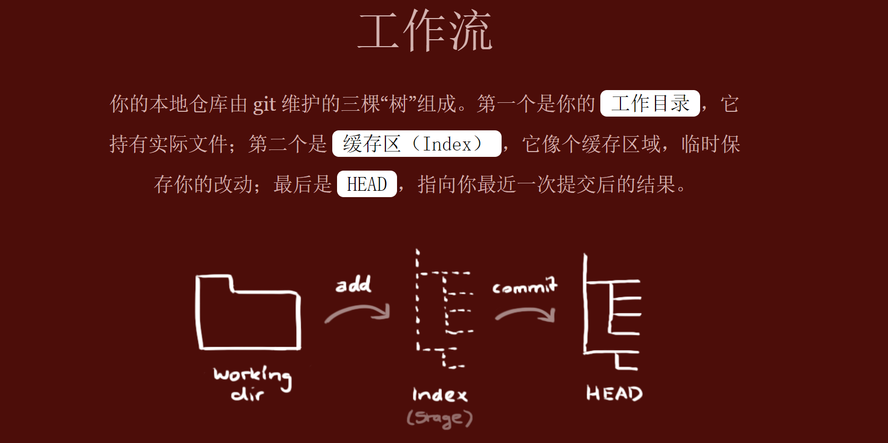

## 入门

------




------

问题：

- github网页上面的default分支又是什么？pull request又是啥pr？issues？
- 不同分支，暂存区有几个，版本库有几个，又是如何与 git add 与 git commit 搭配的？
- origin代表远程主机名？


## 命令

```shell
git commit -a(m '')
# 代替git add 与 git commit的组合
```

```shell
git reset
	--mixed # 默认参数，可以不用带该参数，用于重置暂存区的文件与指定提交(commit)保持一致，工作区文件内容保持不变
	--soft # 参数用于回退到某个版本
	--hard # 参数撤销工作区中所有未提交的修改内容，将暂存区与工作区都回到指定版本，并删除之前的所有信息提交
git reset --hard origin/master # 将本地的状态回退到和远程的一样 
```

```shell
git rm
	git rm runoob.txt # 从暂存区和工作区中删除 runoob.txt 文件
	git rm -f runoob.txt # 强行从暂存区和工作区中删除修改后的 runoob.txt 文件
	git rm --cached runoob.txt # 从暂存区中删除 runoob.txt 文件，而在工作区保留该文件
```

```shell
git remote # 查看当前配置有哪些远程仓库
git remote -v # 看到每个别名的实际链接地址
git remote add [shortname] [url] # 添加远程版本库, shortname 为本地的版本库

#在本地创建本地仓库，并关联到已经创建好的刚刚初始化的远程仓库
	cd existing_folder
	git init
	git remote add origin git@github.com:tianqixin/runoob-git-test.git
	git add .
	git commit -m "Initial commit"
	git push -u origin master
```

```shell
git fetch
通常git fetch后要git merge
```

```shell
git pull
# git pull 其实就是 git fetch 和 git merge FETCH_HEAD 的简写

git pull <远程主机名> <远程分支名>:<本地分支名>
git pull origin master:brantest # 将远程主机 origin 的 master 分支拉取过来，与本地的 brantest 分支合并。
git pull origin master # 将远程主机 origin 的 master 分支拉取过来，与当前分支合并，可以省略冒号

```

```shell
git push
git push <远程主机名> <本地分支名>:<远程分支名>
git push <远程主机名> <本地分支名> # 如果本地分支名与远程分支名相同，则可以省略冒号

git push origin master # 将本地的 master 分支推送到 origin 主机的 master 分支
git push origin master:master # 同上
git push --force origin master:master # 本地版本与远程版本有差异，但又要强制推送
git push -u origin master # -u参数记录push到远端分支的默认值，之后可用git push代替git push origin master
```

问题：

- git fetch 与 git pull


## 分支

```shell
# 列举本地分支
git branch

# 创建分支
git branch (branchname)

# 切换分支
git checkout (branchname)
# 切换分支的时候，Git 会用该分支的最后提交的快照替换你的工作目录的内容

# 创建新分支并立即切换到该分支下
git checkout -b (branchname) 

# 删除分支命令
git branch -d (branchname)
```

master分支只是默认的，并不是一定存在。

问题：

- git merge (branchname) # 将该分支merge到master分支上/还是当前分支?
- 只有一个分支的文件完全包含了另一个分支的该文件时，才能完成自动merge吗？（没有冲突就能自动merge）


## 标签

```shell
git tag # 查看所有标签

git tag -a v1.0 -m '' # 为最新一次提交打上“v1.0”的标签
git tag -a v0.9 85fc7e7 -m '' # 为以前的提交追加标签
git tag -d <tag_name> # 删除某个标签，本质上就是移除 .git/refs/tags/ 中对应的文件

git push <remote> --tags # 推送所有标签到远程仓库。
git push <remote> --delete # <tag_name>：删除远程仓库中的某个标签。

git tag -a <tagname> -m "runoob.com标签" # 指定标签信息命令
git tag -s <tagname> -m "runoob.com标签" # PGP签名标签命令
```


## 示例

### init

```shell
mkdir test
cd test
git init
git remote add origin git@github.com:Benevor/test.git
git remote

touch a.txt
echo 'init file'>a.txt
git add .
git commit -m 'init'
git push origin main

git branch dev
git checkout dev
git push origin dev/git push --set-upstream origin dev
```

```shell
git clone git@github.com:Benevor/test.git
cd test
git remote

touch a.txt
echo 'init file'>a.txt
git add .
git commit -m 'init'
git push origin main

git branch dev
git checkout dev
git push origin dev/git push --set-upstream origin dev
```

问题：

- 新分支dev发布到远端后再push，github会出现pull request，可以不管吗？

### 自动merge

```shell
# 基于init
# 在dev分支上，下先后修改两次文件，commit，push为1 dev；2 dev
# 切换到main分支
git merge dev
git push origin main

# merge之前
# main只有一次提交 init
# dev有三次提交 init ; 1 dev ; 2 dev

# merge之后
# main和dev同样有三次提交 init ; 1 dev ; 2 dev

# merge完成之后,删除和修改dev分支都不会影响main分支
```

### 手动merge

```shell
# 基于init
# 在dev分支上，修改文件，commit，push为 dev；dev1
# 切换到main分支，修改文件，commit，push为 main

# 将dev分支merge到main分支
git merge dev
# 出现冲突
手动修改文件，解决冲突
git add .
git commit -m "Merge branch 'dev'"
git push origin main

# merge之前
# main有2次提交 init ; main
# dev有3次提交  init ; dev； dev1

# merge之后，网状结果like image9
# dev分支不变
# main有5个提交：init; main; dev; dev1; Merge branch 'dev'
# 也就是说，main分支会保留merge之前dev分支的commit

# merge完成之后,删除和修改dev分支都不会影响main分支
```


### rebase

https://blog.csdn.net/t949500898/article/details/108572456

与merge的区别

- merge 会多出一次 merge commit，rebase不会
- merge 的提交树是非线性的，rebase 的提交树是线性的（通过重写提交历史）

rebase工作流

```shell
git rebase
while(存在冲突){
 	git status
	解决冲突
 	git add -u
 	git rebase --continue
 	if(git rebase --abort)
 		break;
 }
```

merge工作流

```shell
git merge
编辑冲突文件
git add .
git commit -m "feat: this is a comment"
git push
```

命令行rebase

```shell
# 基于init
# 在dev分支上，修改文件，commit，push为 dev
# 切换到main分支，修改文件，commit，push为 main

git checkout dev
git rebase main
/ git rebase main dev  

# 出现冲突，like image11/10
手动修改文件，解决冲突
git add a.txt
git rebase --continue
在vim编辑器中输入comment   #image12

# rebase之前
# main有2次提交 init ; main
# dev有2次提交  init ; dev
# rebase结束,dev分支有3个提交:init; main; rebase main

git push origin dev --force
然后再给远端的main分支 PR
# pr流程：image
# pr结束：main四个提交:init; main; rebase main; merge
```


问题：

- 实际工作流程中rebase到底地变基dev分支，还是main分支？需不需要pr，pr的意义是什么？和那种fork别人的仓库修改后pr有什么不同？https://blog.csdn.net/DongAoTony/article/details/123576826

- rebase完成之后的push，不用--force不可以，为什么?使用vscode同样需要force；clion则是直接提供了强制推送选项

### pull | fetch

```shell
# 基于init
# 本地代码B的dev分支添加dev提交，并同步到远端仓库
# 本地代码A,B都同步到 dev提交
# 本地代码B的dev分支添加dev1提交，并同步到远端仓库

命令行：
	git fetch
	git merge origin/dev  或者直接  git merge
	# 上面两个等价git pull

vscode：
	fetch
	“同步更改”选项，点击后自动merge，本地A代码和远端同步
	# 上面两个等价直接pull

clion：
	提取/fetch
	合并 origin/dev
	# 上面两个等价直接 拉取/pull
```

### reset

撤回已经add的文件

```shell
git reset 单个文件
```

撤回已经commit的文件

```shell
git log
git reset <commit-id>
```

撤回已经push的文件

```shell
git log
git reset --hard <commit-id>
git push origin HEAD --force
```

