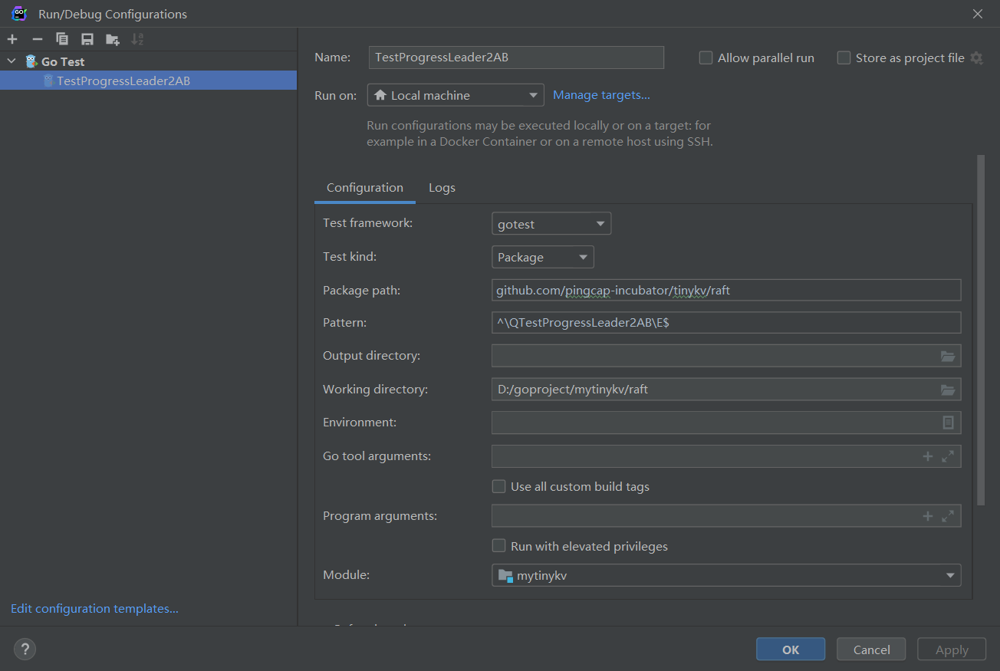

## 安装Go

### Ubuntu

1. 下载go压缩包

   https://golang.org/doc/install

   复制下载链接：https://golang.org/dl/go1.17.3.linux-amd64.tar.gz

   或者：https://dl.google.com/go/go1.17.3.linux-amd64.tar.gz

   在ubuntu任意目录下(/home/liujibo/go_download)下载：wget https://golang.org/dl/go1.17.3.linux-amd64.tar.gz

2. 解压压缩包到指定位置

   ```shell
   sudo rm -rf /usr/local/go 
   sudo tar -C /usr/local -xzf /home/liujibo/go_download/go1.17.3.linux-amd64.tar.gz
   查看/usr/local/下有无go目录
   ```

3. 查看go安装是否成功

   ```shell
   export PATH=$PATH:/usr/local/go/bin
   go version
   ```

4. 配置环境变量

   ```shell
   vim ~/.bashrc
   在最后一行加上：export PATH=$PATH:/usr/local/go/bin
   :wq保存后退出
   source ~/.bashrc，使环境变量生效
   # 这样每次进入系统，环境变量都是有效的
   ```

5. 更改下载源

   ```shell
   go env（查看现有的配置）
   go env -w GO111MODULE=on
   go env -w GOPROXY=https://goproxy.cn
   ```

### Windows

1. 下载压缩包

   ```shell
   https://go.dev/dl/
   go1.17.3.windows-amd64.zip
   ```

2. 解压到D盘

   ```shell
   D:\go
   ```

3. 设置环境变量

   ```shell
   系统变量的path中，添加D:\go\bin
   新建系统变量：D:\goproject
   ```

4. 验证

   ```shell
   go version
   go env
   go env -w GO111MODULE=on
   go env -w GOPROXY=https://goproxy.cn
   ```

## 路径配置

```shell
# 通过go env命令可以看到 GOROOT 和 GOPATH 路径
GOPATH="/home/liujibo/go"
GOROOT="/usr/local/go"
```

## 包管理

### 问题：

- go.mod必须和main.go在同一目录级别吗？
- go的包管理和windows有何不同吗？

## IDE配置

以vm-ubuntu为开发环境，tinykv为编程项目，配置 Goland 与 VsCode 的 go mod 、运行、调试的配置过程

建议不要使用wsl，debug的配置有问题

### VsCode-ssh

通过ssh插件连接vm-ubuntu

```shell
安装Go插件   # 为了代码自动格式化和单个函数测试

go install -v golang.org/x/tools/cmd/goimports@latest
go install -v github.com/rogpeppe/godef@latest
go install -v github.com/mdempsky/gocode@latest
go install -v golang.org/x/tools/gopls@latest
go install -v github.com/ramya-rao-a/go-outline@latest

go mod tidy
# make project2a测试是否能完成tinykv板块的测试


# run test
go get -u github.com/go-delve/delve/cmd/dlv
# 或者
go install github.com/go-delve/delve/cmd/dlv@latest

Crtl+Shift+P：Go:Install/Update Tools # 全选安装
# 找到/raft/raft_test.go文件，看到func TestProgressLeader2AB(t *testing.T)左侧有绿色小三角

# debug test
在运行和调试模块，点击创建 launch.json文件；
使用默认生成的配置文件就行
```

问题：

- debug test在wsl-ubuntu中存在问题，如下。但是使用ssh+vm-ubuntu+同样的配置过程不会有下面的问题，可以正常debug test

```shell
# launch.json
{
    // 使用 IntelliSense 了解相关属性。 
    // 悬停以查看现有属性的描述。
    // 欲了解更多信息，请访问: https://go.microsoft.com/fwlink/?linkid=830387
    "version": "0.2.0",
    "configurations": [
        {
            "debugAdapter": "dlv-dap",
            "dlvFlags": ["--only-same-user=false"],
            "name": "go test",
            "type": "go",
            "request": "launch",
            "mode": "test",
            "program": "${workspaceFolder}",
            "args": [
                "-test.run",
                "MyTestFunction"
            ]
        }
    ]
}

# 调试错误信息
Starting: /home/liujibo/go/bin/dlv dap --check-go-version=false --listen=127.0.0.1:51122 --log-dest=3 from /home/liujibo/mytinykv/raft
DAP server listening at: 127.0.0.1:51122
closing connection from different user (127.0.0.1:51123): connections to localhost are only accepted from the same UNIX user for security reasons
2022-08-10T19:17:26+08:00 error layer=dap Error accepting client connection: Only connections from the same user that started this instance of Delve are allowed to connect. See --only-same-user.
dlv dap (610) exited with code: 0
```

### VsCode-local

和VsCode-ssh一样

注意：在tinykv项目中需要对makefile进行修改，因为原有makefile是适配linux系统写的。

### GoLand-local

基于本地go环境，即windows

```shell
在右上角设置图标->go settings->go->go root->local，设置go root为D:\go
go mod tidy

# 可以用命令行执行gotest
D:\goproject\mytinykv\raft> go test -run TestProgressLeader2AB

# 也可以在IDE中进行test run/debug，配置like image1
```


